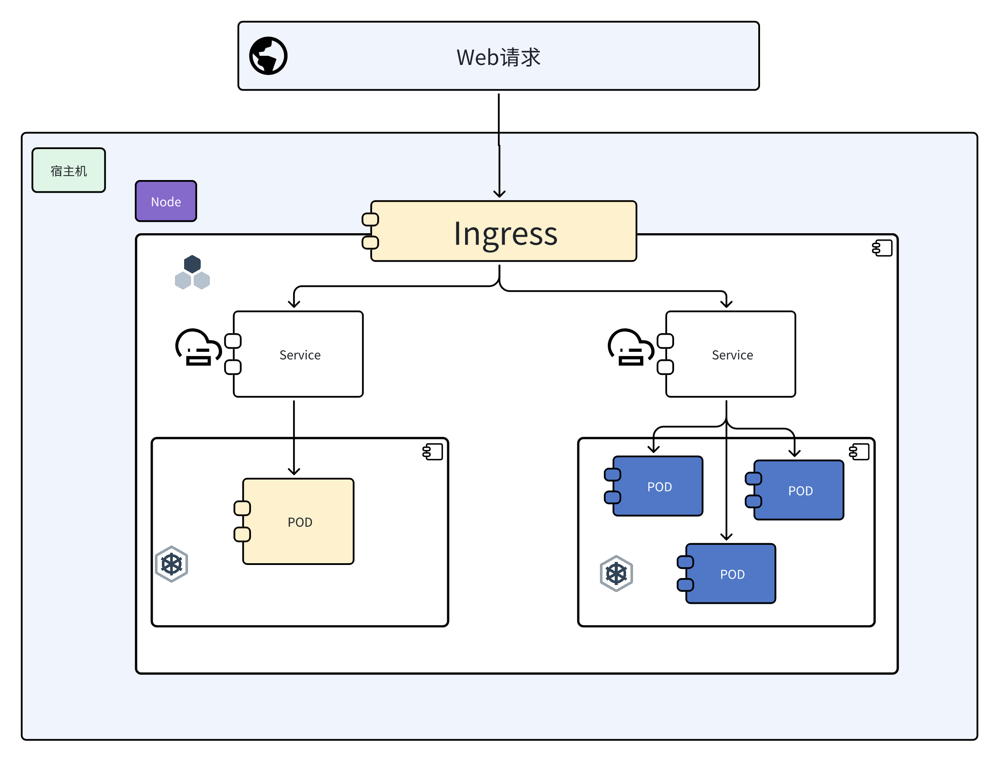
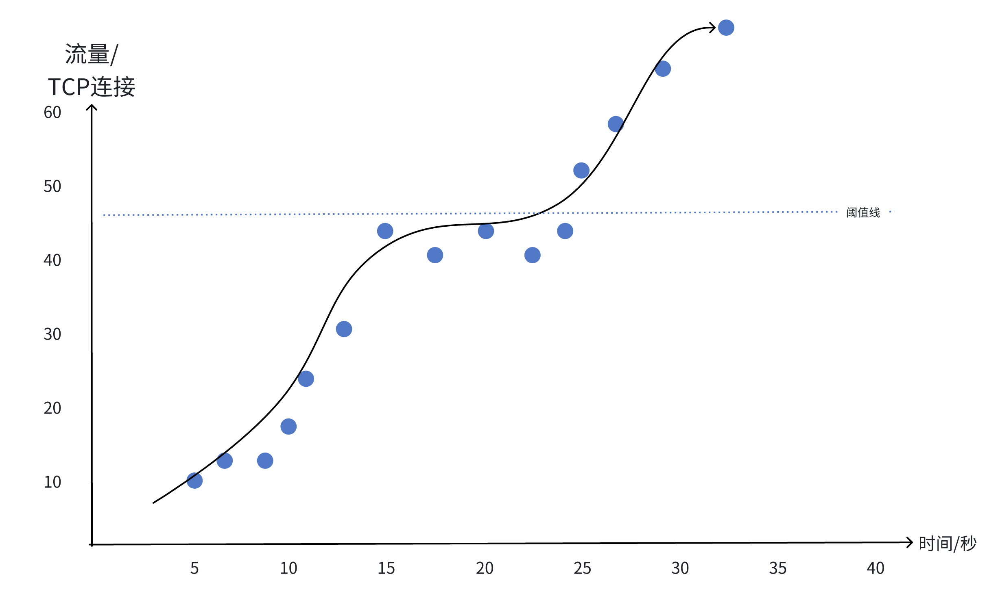
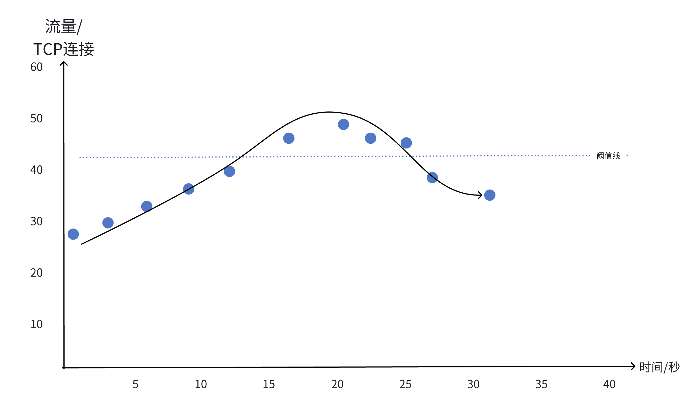
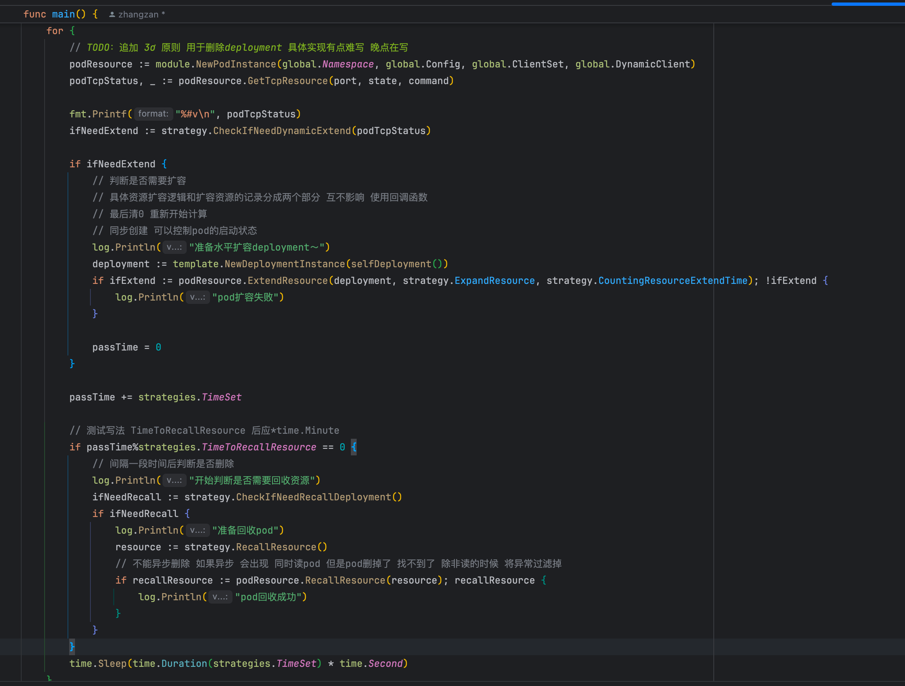
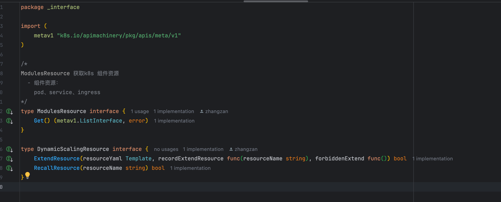
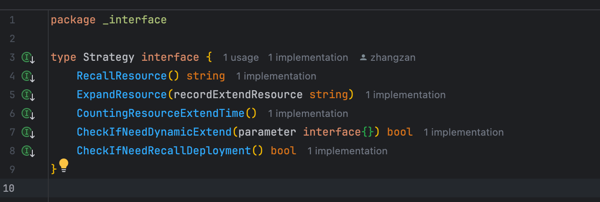

## 弹性伸缩理解与思考--Kubernetes

### kubernetes的前世今生

&nbsp;&nbsp; 随着容器技术的爆火🔥，注诸如docker的容器化技术如雨后春笋般在市场上出现，我们可以很轻松的通过容器启动我们的服务程序，
至此通过容器的形式启动服务成为市场主流的服务部署形式。  
&nbsp;&nbsp; 但是容器技术的繁荣和也带来了问题，当我的服务器上部署了十几个以上不同的容器，或者十几个容器分别部署在不同的服务器上，
这些容器要如何管理呢？🤔🤔🤔 我们总不可能容器启动了就不管了吧，服务是否可以扛下压力？服务是否需要扩容？有状态服务是否要扩容和状态数据
如何转移？这些诸如此类的运维问题都需要解决。  
&nbsp;&nbsp; 那么这个时候**Kubernetes**就横空出世。`Kubernetes`  是一个开源的容器编排平台，
旨在自动化应用程序的`部署`、`扩展`和`管理`。它通过协调集群中的容器化应用，提供高`可用性`、`可扩展性`和`灵活的资源管理`
，从而提升开发和运维效率，简化复杂的微服务架构管理。
-----
### 容器类型有哪些呢？
&nbsp;&nbsp; 在具体讨论弹性伸缩之前，我们需要聊聊容器类型。根据微服务的设计理念，我们可以将一个大的单体项目拆解成多个功能集中的小的微服务，
然后服务与服务之间通过`网络协议`实现微服务的调用。这样每个微服务的代码就更加`干净`、`简洁`，但是也会又一个很大的问题。  
> &nbsp;&nbsp; 我们在这里不讨论服务与服务之间的网络通信，只从容器层面来进行探讨。

&nbsp;&nbsp; 微服务各司其职了，那么一些写在服务内的状态变量怎么办？ 在原有的单体项目架构下，我们可以很轻松的通过全局变量+单例模式
控制状态。例如：
- 记录当前的用户登陆人数
- 记录当前接口的实际流量
- 记录用用户是否登陆  

&nbsp;&nbsp;  但是随着服务的拆解和解耦，虽然我们可以继续使用上面的模式记录状态变量，然后其他服务如果想要访问这些状态
变量的话就要通过网络层进行微服务调用。这显然让微服务变得很复杂，所以我们会使用诸如`Redis`、`Mysql`、`Neo4j`
等数据库来存储这些状态变量，这样我们的微服务就是一个`无状态服务`了，所有状态变量都存储在持久层的组件当中，
微服务只负责从持久层获取状态变量，然后对这些状态变量做处理。  
&nbsp;&nbsp;  至此，我们实现了微服务的服务拆解，将微服务定义为`无状态的服务`（只负责接收请求，然后根据接口表示的业务逻辑做业务上的处理）。
这也就是为什么Spring、Flask、Gin这些web框架对于MVC的封装默认是单例的了。
> 🤔🤔🤔 方便大家的理解，大家把自己写的controller理解为一个杯子，每次用户实际的接口请求都是向杯子里面加水。接口请求处理完了，水就倒掉了，
> 但是杯子还在。我们总不每能喝一杯水就换一个杯子把，那服务器要哭了。
> > 服务器说：我要扛下500QPS的请求，你让我每秒实例500个对象，然后3-20ms后回收这些对象，这合理吗😭😭😭😭  

&nbsp;&nbsp; 所以大家理解了我们的微服务为什么是无状态的了吗 🤗🤗🤗
&nbsp;&nbsp;  总结一下，我们的最后封装的容器，应该分为两种（其实在无状态容器中还能再拆分，但是我们最后说😊😊）。
* **第一种**：`无状态容器`：这类容器处理我们的接口请求，后端维护的线程等。也就是我们Go、Java服务  
* **第二种**：`有状态容器`：这些容器存储我们的状态变量，容器形态通常是是数据库。也就是我们的Mysql、Redis
--- 

### 针对无状态容器的动态伸缩
&nbsp;&nbsp; 重点来了！！<u>**无状态容器的伸缩场景以及如何对无状态容器进行伸缩呢**?</u>  
&nbsp;&nbsp; 附上一个Kubernetes的`架构图`

--- 

### 动态伸缩的业务场景
&nbsp;&nbsp; 现在假设我们有一个流量激增的业务场景（一般是一些限时活动、即时响应的业务），当我们的流量迅速攀升，
一个服务容器不够用了，我们就需要马上扩容，将流量分散到多个服务容器中，这样才能`消峰`。然后通过负载均衡组件（Kubernetes的service组件）将流量分发到同一个服务的多个容器中。
这样我们就实现了容器的水平扩容。  
> PS: 当你的QPS（每秒查询数）突然飙升，超过了服务器的处理能力时，服务器可能无法及时处理所有的请求。
> * 请求排队：超出处理能力的请求会被放入队列中等待处理。 
> * 请求超时：如果请求等待时间过长，可能会导致请求超时。 （408  Request Timeout 或者 504 Gateway Timeout）
> * 服务器过载：持续的高QPS可能会导致服务器资源（如CPU、内存、网络带宽等）耗尽，进而影响服务器的稳定性。

&nbsp;&nbsp;  等到流量下降之后，我们再对这些扩容的容器进行回收。这样就可以保证我们线上服务的稳定性，提高服务的可用性。  
&nbsp;&nbsp;  实际业务场景：
* [bilibili 腾讯视频VIP充值业务崩溃，服务限流、服务扩容、拒绝策略](https://www.bilibili.com/video/BV1F94y1J7Cd/?spm_id_from=333.337.search-card.all.click&vd_source=216d97692ea197203e978fe393ff944c)

&nbsp;&nbsp; 但是需要注意⚠️：我们水平扩容的容器应该是无状态容器。如果是有状态容器，如数据库容器，容器创建之后接入到数据库的集群中，数据同步会花费很长的时间，
而且数据的一致性也需要做保证和校验，只要是同步就会有时延。这也是为什么数据库需要预先搭建高可用集群的原因。

--- 
### 动态伸缩策略
&nbsp;&nbsp; 来了～ 来了～  
&nbsp;&nbsp; 借鉴一下阿里云伸缩策略，我简单罗列一下目前主流了5种伸缩策略，以及我使用的`目标伸缩式规则`
> 1. 保持固定数量且可用的实例🔥
- 适用场景：在不伸缩时，维持集群的高可用。
- 实现方式：为伸缩组开启实例健康检查和期望实例数。
- 在开启伸缩组实例健康检查后，伸缩组会自动移除伸缩组中不健康的实例。如果目前实例数小于期望实例数，会自动触发扩容，保证伸缩组中始终有固定数量且可用的实例。
- 举例说明: 例如您期望集群可用业务服务数量为10，您可以为伸缩组设置期望实例数为10，伸缩组会自动触发伸缩活动来维持可用服务数量为10。
> 2. 定时自动伸缩🔥🔥
- 适用场景：业务规律波动，即业务集群资源占用随时间规律波动。
- 实现方式：通过为伸缩组设置定时任务实现定时扩缩容。
- 在业务集群资源占用升高的时间点，通过定时任务触发扩张。相反的，在资源占用降低的时间点，通过定时任务触发收缩。完整步骤，请参见定时自动扩缩容ECS实例。
- 举例说明:
- 例如您的业务集群在每天傍晚7点时访问量增加，在凌晨1点时降低，为了应对业务访问需求的变化，您可以设置以下两个定时任务。
    - 应对访问量增加：设置傍晚7点的定时扩展任务，在每天傍晚7点，通过增加服务副本数提升集群的承载能力。
    - 应对访问量减少：设置凌晨1点的定时收缩任务，在每天凌晨1点，通过减少服务副本数从而提高资源利用率，减少不必要的成本支出。
> 3. 通过资源占用阈值伸缩（CPU占用率、内存占用率等）🔥🔥🔥
- 适用场景：突发业务波动场景。资源占用达到某个阈值时触发伸缩。
- 两个解决思路 （假想一个开口向下的二次函数，中间有个水平阈值的分割线）
    - 资源占用达到阈值后触发报警，进行扩容 然后削弱峰值
        - 报警后直接增加实例
        - 根据资源占用的阶梯变化灵活设置扩缩容的数量。
        - `划分多个梯度`，超过梯度1的时候就新增1个实例，超过梯度2的时候新增2个实例
    - 设置`目标追踪规则`，实现将伸缩组的资源占用维持在目标值附近。`(这个是我要实现的)`
        - 为ECS伸缩组创建一个目标追踪规则，设置平均CPU占用率的目标值为80%，伸缩组会自动通过添加或删除实例来将伸缩组平均CPU占用率维持在80%附近。
        - 我是根据TCP连接数来确定的
> 4. 自定义伸缩（手动伸缩）
- 提前写好创建脚本，运维人员参与监控，手动伸缩
> 5. 预测性伸缩🔥🔥🔥🔥 
- 该方案通过配置预测规则的方式实现，您可以先使用只预测不伸缩的方式判断预测的准确性和适用性，如果预测结果满足您的需求，您可以为该预测规则开启预测并伸缩，开启此选项后，预测规则会根据预测产生的定时计划自动创建预测任务，完成自动扩缩容。具体操作，请参见查看[预测规则效果](https://help.aliyun.com/zh/auto-scaling/user-guide/view-the-prediction-effect-of-a-predictive-scaling-rule)。
- 这个很好，但是需要时序类型的预测算法，不会。只会基于统计学的机器学习方法。😭😭😭😭  
- `我的设想是`🤔🤔🤔🤔🤔：
  - 1、统计每日多个时刻的容器流量数据，呈现一个散点图，这个散点图类似于一个呈现峰值和波谷的曲线，但是不预测曲线，而是预测散点分布。
  - 2、预测散点分布，即表示预测每天同一时刻流量的大小。
  - 3、模式：
    1. 提取3个月每天每个时刻流量大小（不一定三个月，可以更长或者更短）
    2. 生成一个二维数组`train[i][j]`，`train[i][j]`表示的是每天的第i个时刻，在三个月内的第j天的实际流量是`train[i][j]`
    3. 然后使用k折交叉验证，进行k次训练，最终得到一个预测模型
    4. 最后就可以预测了
    5. 同时这个模型可以增量滚动进行，逐步扩充训练数据，可以每天\每周\每月训练一次
    6. 通过上面的形式，模型的选择就可以很多了，不一定是按时序模型来做预测（纬度变了，从每天的流量变化，变成了每个时刻每天的波动变化情况），就可以用XGBoost或者随机森林

--- 
### 目标追踪式规则

&nbsp;&nbsp; 根据阿里云提供的文档以及思考🤔,我不打算以单一以容器（pod）的CPU使用情况为参考，而是以TCP的连接数为参考。
因为CPU的使用率还受到其他资源影响，如服务与数据库、Mq等中间件的网络I/O（mybatis设置的连接数、mq的连接），文件读写I/O。

&nbsp;&nbsp;  我们可以根据服务对外暴露的唯一端口 使用 `ss` 或者`netstat` 对服务的端口的进行监控，间隔等长时间查询服务的`TCP连接数`
然后根据这个`TCP连接数`的变化情况判断流量是否激增或者趋于平缓，从而作出合适的伸缩判断 。  
&nbsp;&nbsp;  端口很重要，因为还有连接其他端口的线程，如数据库连接、异步线程
&nbsp;&nbsp;  流量走势场景：
> 
快速增长📈

> 
低速增长📈

#### 扩容判断策略📌📈
&nbsp;&nbsp;  对于流量激增我们有3种判断策略，每次三种策略都会对当前的一段时间进行判断，只有投票Yes的数量大于投票No的数量才会允许扩容  
&nbsp;&nbsp;  一段时间：自定义为3min、5min、10min，称之为窗口🪟
1. 窗口时间内，判断TCP连接数的`平均增速`。  
   * 计算连续两点的斜率，然后计算窗口时间内斜率的平均增长速率，如果窗口时间内斜率的平均的增长速率超过了限定阈值，那么就要投票Yes。
2. 窗口时间内，判断TCP连接数是否`超过阈值`。
   * 计算窗口时间内TCP连接数超过阈值的个数是否超过负载，如果超过就会投票Yes。
   * 负载定义为窗口时间内统计的TCP连接的次数*负载因子（0～1的一个数），表示的意思是 窗口时间内 有3/4时间TCP连接数都超出阈值了
3. 窗口时间内，判断TCP连接数的`最大值和最小值的差`。
   * 计算窗口时间内TCP连接数量的最大值和最小值，`最大值和最小值的差`>`最小值的两倍`，那么投票Yes
   * 因为存在流量赠长后，维持稳定，然后又迅速增加的情况，此时策略1失效

#### 回收判断策略♻️📉
&nbsp;&nbsp;  对于流量下降我们有2种判断策略，2种策略比扩容策略更加严苛，因为线上稳定才是重要的，2中策略必须同时满足才会回收资源，防止多次重复扩容和回收。  
1. 窗口时间内，判断TCP连接数的`平均下降速率`<=0
   * 窗口时间内，TCP连接连接数呈现下降趋势，斜率为负数，我们希望斜率大部分为负数，波动下降，投票为Yes 回收。
2. 窗口时间内，判断TCP的连接数是否`小于阈值` （⚠️这个是最重要的）
   * 计算窗口时间内TCP连接数小于阈值的个数是否超过最小限额，如果超过就会投票Yes 回收。
   * 限额定义为窗口时间内统计的TCP连接的次数*限额因子（0～1的一个数），表示的意思是 窗口时间内 有3/4时间TCP连接数都低于阈值了

&nbsp;&nbsp;   注意⚠️：追加一个限定条件，扩容之后5min内不允许回收，回收策略的判断是在5分钟之后进行（
逻辑上，实际代码依然是间隔时间内做轮训判断，但是有一个状态变量会在扩容5分钟后异步改变，根据这个状态变量做实际回收策略判断）

---    
### 具体实践
> 
核心代码-轮询策略

> 
核心代码-kubernetes操作接口

> 
核心代码-strategy操作接口

1. TCP连接数的监控实质是一个轮询，每次间隔固定时间对Kubernetes的资源做一次查询
   * 这里的资源就是pod，然后做是否扩容的判断
   
2. 轮询中会进行`是否扩容`的判断 以及 扩容成功后6分钟的`是否回收`判断
   * 具体多少时间后回收，自定义即可，但是不应该小于窗口时间，时间长一点是可以的
   
3. 如果扩容策略判断Yes就通过`Kubectl Api`对 Kubernetes的资源做扩容
   * 核心代码见`./kubernetes/module`
   * 注意⚠️：
     1. 需要提前构建好 Kubernetes 组件的自动yaml，参照`./kubernetes/template`模版准备好deployment模版
     2. 必须写 deployment-name，label，port
     3. ⚠️ ❗️❗️`label`需要和kubernetes中`service`绑定的`label`匹配，不然service无法路由到具体的pod，如果无法路由，扩容也无效了

5. 最后流量下降后就可以做资源上的回收♻️
   * 原先设想的是异步回收资源，但是在轮询中存在或许到了pod的名字 但是查询pod的TCP连接数的时候pod被删除了，就会报错。于是就改成同步了
> PS-1: 在strategies包中有全局变量，同时有异步线程的存在（具体见代码，上面提到的异步休眠5分钟），此时追加锁🔒，防止异步线程对状态的修改影响主线程的判断  

> PS-2: Kubernetes的核心组件见架构图，至此实现Kubernetes 资源的伸缩策略

> PS-3: Kubernetes其实提供了默认的伸缩策略，不需要自己写代码，但是出于自己的好奇心想研究一下容器化开发，以及觉得Kubernetes默认针对CPU的监控策略是个黑盒，监控策略定制化不高就自己写了一个

### 额外的思考和注意细节
1. 目前是本地的形式跑起来的，本地Kubernetes集群是单结点模式，对于多结点扩容策略要怎么做还没有想好，
   因为要考虑新建的pod会在不同的Node中，ingress和service如何路由到其他Node中的pod目前还不会，后面再研究一下。这一块就上升到分布式了，有点难。  
   现在只会单结点的ingress->service->pod的路由
2. 目前是在Kubernetes外部做的监控，也可以转换成Kubernetes内部做监控，语法换一下就可以了。
3. 还可以接入jenkins进行更新、扩容和回收/通过jenkins执行脚本，执行kubectl指令从而对Kubernetes的资源做更新

